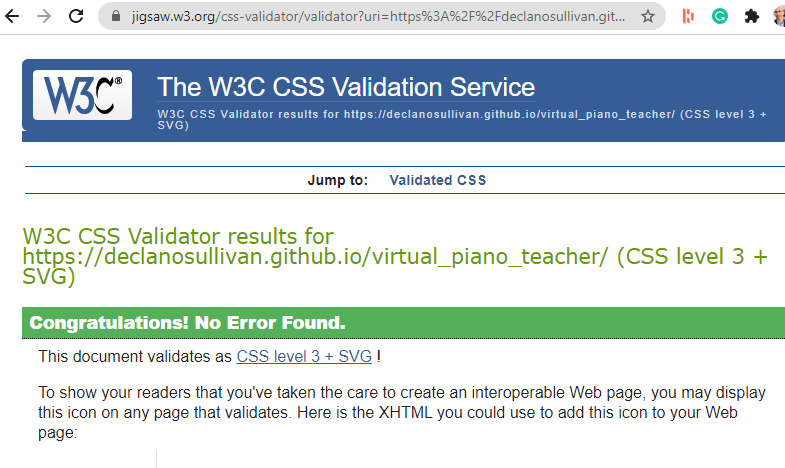

# Virtual Piano Teacher

## Overview

### What is the purpose of this project?

- To create a 1-2 octave virtual piano that teaches it's user snippets of classical/baroque music. 

### What is an octave?

- This is best ansnwered by the wiki page on Octave
https://en.wikipedia.org/wiki/Octave

### Why classical/baroque  music?

- The music is often free of copyright such J.S Bach's Prelude in C Major (link below), sometimes well known from movies/commericals. This particular piece is from Bach's Well-Tempered Clavier, considered one of the most important works in keyboard history.
https://www.youtube.com/watch?v=frxT2qB1POQ

- Depending on the piece, it can show someone new to this era/period of music that a lot of emotion and feeling can created from playing just 3-4 notes like shifting just one note a step up or down of those 3-4 notes can change the mood from joy to melancholy. 

### Why snippets?

- As this is not a real piano/keyboard but virtual, the user will be using either their mouse or computer keyboard to play/interact. It's entertaining for the user for 1 minute this way, for 3/4 minutes it would tedious. 

### Why did I choose this topic for project no. 2?

- Music, specifically the piano, has been a part of my life from a young age. At the age of 7/8, my mom started teaching me the piano she had learned as a child on the same piano she grew up on, that my cousins of the next generation are now learning the piano on (three generations and counting!).

- From lessons my mom gave me and my brother, I then went on to study general music as my optional subject for my leaving certificate and then choose music as part of undergraduate BA. 

## UX

### User Stories

* As a user, I need to open the site and see full two octaves of piano without scrolling.
* As a user, I need instructions on how to use the website/app.
* As a user, I need an easy way (i.e button) to have the website start teaching me a snippet of music
* As a user, I need the piano to highlight (i.e red) which key I should click next.
* As a user, I need the piano to highlight to a different colour when I've clicked the correct key (i.e blue)
* As a user, I also need to hear the correct piano sound when I click any key - correct or incorrect. 

### Wireframes

Below is the wireframe showing the piano not in action. The user presses start button for the virtual piano teacher to start and then stop at any time to end.

This wireframe shows the piano highlight in red which piano key the user needs to press next. 

This wireframe shows the key when the user has clicked on it. 

### Features

## Features

Implemented  | Feature
------------- | -------------
Yes  | Website loads with a two octave piano with correct black and white keys
Yes  | Convert sheet music song to ABC notation that matches audio tags
Yes  | There is a start button to iniate user being taught snippet of music
Yes  | The key highlights red indicate to the user to click it
Yes  | A sound plays when the user clicks either the highlighted key in red or an incorrect key
Yes  | The key highlights in blue confirming the user has clicked it
No  | The notes play for the appropriate lenght (4 beats, 2 beats, 1 beat)
No  | There is a dropdown allowing the user to choose different song snippets to learn
Yes | Pop up once song is complete alerting user. 
Yes | Pop up modal displaying instructions on how to use website/app.
No | Drop down menu to select from list of songs

## Bugs - Fixed 

1. Piano sounds would not play when user click on piano key. I was using incorrectly formatted audio tags.
    Now update to format shown here: https://www.w3schools.com/tags/tag_audio.asp
2. Incorrect sounds were playing when user clicks on piano keys. Audio files in pianokeys folder where named inconsistenly. 
    Now updated to follow format octave and letter. 1C, 2B etc. 
3. Song would not play passed the first note. I had incorrectly translated sheet music to ABC notation and format to format array correctly. 
    Now fixed by using ABC noation that matches data-note IDs = 1C, 2B. 
4. Black notes won't play today Oct 10th. The will highlight blue but no sound plays. The only different is the in the naming of the sound files. The black keys have a # symbol to indicate sharp. I've replaced the # with the word sharp and updated audio tags. 

## Bugs - Not Fixed 

1. If a key does not have a sound recording to play i.e. it's missing. The key gets stuck on blue. It would be good to include some type of error handling so the user can continue learning. 

## Libraries & Technologies Utilised

* [HTML](https://developer.mozilla.org/en-US/docs/Glossary/HTML5) - used to define the content and structure of website.
* [CSS](https://developer.mozilla.org/en-US/docs/Web/CSS) - used to define the appearance and presentation of the website.
* [Javascript](https://developer.mozilla.org/en-US/docs/Web/JavaScript) - used to create dynamically updating content, control multimedia, animate images, and add behaviour to a site.
* [Git](https://www.atlassian.com/git) - used for branching, merging, and rewriting repository history.
* [GitHub](https://github.com/) - used a hosting service for Git repositories.
* [Gitpod](https://gitpod.io/) - used as a workspace for Git repositories.
* [CSSgrid](https://developer.mozilla.org/en-US/docs/Web/CSS/CSS_Grid_Layout) - used to create a highly responsive grid that's structure is easily manipulated.
* [Google Fonts](https://fonts.google.com/share?selection.family=Oxygen%7CUbuntu) - Used to select and embed fonts in respository.
* [Material.io](https://material.io/resources/color/#!/?view.left=1&view.right=1&primary.color=D1C4E9&secondary.color=BBDEFB&secondary.text.color=000000&primary.text.color=0a0a0a) - Used to select and create primary and secondary colour paletete.
* [Font Awesome](https://fontawesome.com/) - Used to select and import icons into project.
* [Convertio](https://convertio.co/) - used to convert audio recordings from m4a (recorded piano notes on my iphone) to mp3.

## Testing

### Validators

* [HTML - W3C HTML Validator](https://validator.w3.org/)

> Passed

* [CSS - W3C CSS Validator](https://jigsaw.w3.org/css-validator/)

> Passed

* [Javascript - Jshint Javascript Validator](https://jshint.com/)

> Passed - note I configured Jshint to accept New JavaScript features (ES6).

* [Google Lighthouse](https://developers.google.com/web/tools/lighthouse)

    Mobile

    Desktop

### Compatibility

I've tested the site in the following browswers on desktop and mobile:

* Desktop - Chrome 95.0.4638.54

* Mobile - Chrome 95.0.4638.50

* Desktop - Brave 1.31.87

* Mobile - Brave 1.32

* Desktop - Edge 95.0.1020.30

* Mobile - Edge 93.961.64

* Mobile - Safari 15.0

* Mobile - Safari 15.0

### Responsiveness

Desktop
Tablet
Mobile

### User Story Testing

* As a user, I need to open the site and see full two octaves of piano without scrolling.

* As a user, I need instructions on how to use the website/app.

* As a user, I need an easy way (i.e button) to have the website start teaching me a snippet of music

* As a user, I need the piano to highlight (i.e red) which key I should click next.

* As a user, I need the piano to highlight to a different colour when I've clicked the correct key (i.e blue).

* As a user, I also need to hear the correct piano sound when I click any key - correct or incorrect. 

    [Link to video showing sound playing](https://youtu.be/Q-vz1UA_J2U)

## Deployment

The site was deployed to GitHub pages. The steps to deploy are as follows:

* In the GitHub repository, navigate to the Settings tab
* From the source section drop-down menu, select the Main branch
* Once the Main branch has been selected, the page will be automatically refreshed with a detailed ribbon display to indicate the successful deployment.

### Local Deployment

In order to make a local copy of this repos you can type the following command in your IDE terminal:

- `git clone https://github.com/declanosullivan/virtual_piano_teacher.git`

Additionally if you're using gitpod you can [click here](https://gitpod.io/#https://github.com/declanosullivan/virtual_piano_teacher)

## Credits and Learning Experience

### Content

Inspired by the following tutorials:

* Build A Piano With JavaScript - Tutorial by Web Dev Simplified
https://www.youtube.com/watch?v=vjco5yKZpU8

* Make a JavaScript Drum Kit in Vanilla JS! by Wes Bos
https://www.youtube.com/watch?v=VuN8qwZoego

* The website displays in landscape on mobile. Code taken from here:
https://css-tricks.com/snippets/css/orientation-lock/

* Modal code adapted from this websiteL
https://sabe.io/tutorials/how-to-create-modal-popup-box

* Project also inspired by Javascript module on CI LMS and Love Maths project.

### Media

* [Pexels](https://www.pexels.com/) - All images are stock images from this site

### Acknowledgements

I'm really grateful for the support I've received from the CI course, CI community and my July-5p cohort. I'd like in particular to thank my mentor Tim as well as the tutors who've helped me through LMS challenages.